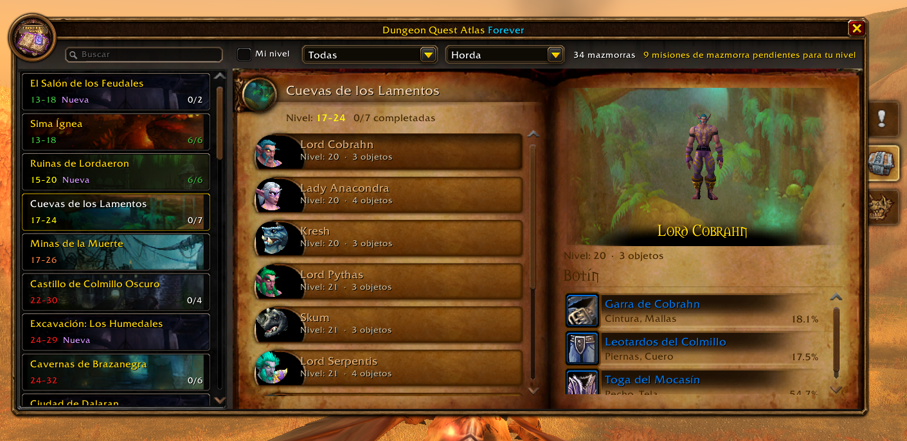
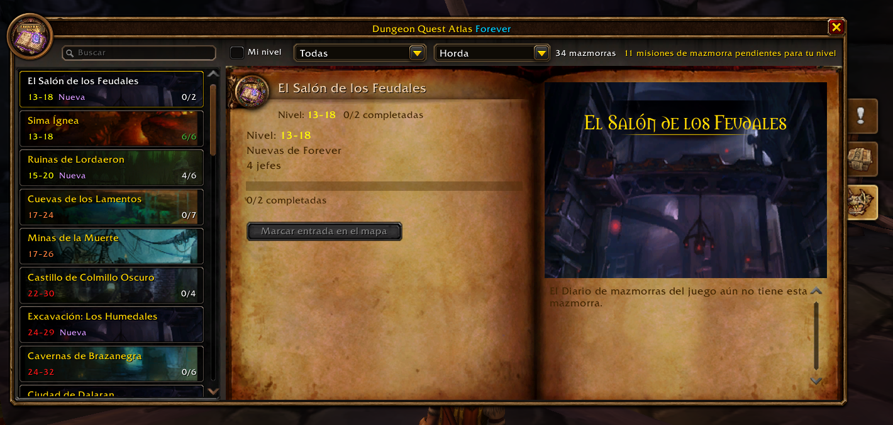

<h1 align="center">Dungeon Quest Atlas Forever</h1>

  <b>Every dungeon quest, boss and loot table in WoW Forever in one window: quest chains, rewards, quest givers, map pins and instance entrances</b>

<a href="#-español">🇪🇸 Español</a>

---

## What it does

**Dungeon Quest Atlas Forever** lists all the **dungeon quests** of **WoW Forever** in a window styled like the game's own **Dungeon Journal**, together with every **boss and its loot**. Pick a dungeon on the left and see every quest for it: its level, faction, whether you already completed it, the **whole quest chain**, the objectives, the **rewards** (with their tooltips and XP), the **quest giver** and where to find them. One click puts a pin on the map, either on the quest giver or on the **instance entrance**, with its own guidance arrow or **TomTom**.

| | |
|---|---|
|  |  |

## Features

- **Every dungeon** of WoW Forever, the classic ones and the new ones (Hall of Thanes, Ruins of Lordaeron, Excavation Site, City of Dalaran, The Drowned City, Krol'dok Stronghold, Alcaz Prison, Blackmaw Hold, Shaper's Terrace), sorted by level and colored by difficulty for your character.
- **300+ dungeon quests** with level, faction and status, shown with the game's own quest icons: **Available** (!), **In progress** (…), **Ready to turn in** (?), **Completed** (✓) or **Locked** (padlock, by level or previous quest). A legend under the list and a tooltip on every quest. A "3/7 completed" counter per dungeon.
- **Quest chains**: every step of the chain with its status and a "(2/5)" in the list. Click any step, even one outside the dungeon, to open its page and mark where it starts. When you turn in a step, the arrow takes you to the next one (option).
- **Class quests** (warlock, paladin, mage...) show the class icon, are locked for other classes and don't count in the "x/y" total. Option to hide them.
- **Your progress** on the quests you carry ("Head of Arugal: 0/1") and a **Share** button to push the quest to your group.
- **Objectives and rewards**: objectives in your game's language, reward cards with icon, quality color and the game's own tooltip (hold Shift to compare), the choice rewards and the ones you always get, XP and money. The new Forever rewards are included.
- **Bosses and loot** of every dungeon: the boss's 3D model (drag to rotate), level, rare spawns and each drop with its chance. Shift+click links the item, Ctrl+click opens the dressing room.
- **Dungeon Journal look**: the game's own journal book, side tabs, boss buttons and loot rows, with each dungeon's artwork and lore taken from your game client.
- Scarlet Monastery, Dire Maul and Stratholme split into wings.
- **Quest start and end**: the NPC or object that gives the quest and the one where you turn it in, with zone and coordinates, and **Mark start** / **Mark end** buttons that also open the world map on the pin. If the NPC is inside the dungeon, the entrance is marked.
- **Instance entrance** of every dungeon, straight from the game's own world map, with a **Mark entrance on map** button (also the portal icon next to each dungeon).
- **Built-in guidance arrow**, no TomTom needed: an on-screen arrow that turns as you move, with the distance, markers on the world map and on the minimap, and it clears itself when you arrive. Left click it to **target the NPC and put a star on them**. NPCs underground (caves, cellars) keep their marker until you talk to them. You can also use the game's own map pin or **TomTom** instead.
- **Wowhead link** for every quest, in the window's language, ready to copy with Ctrl+C.
- **Dungeon maps** of the classic dungeons (WoW Forever has none): a **View map** button with Blizzard's own dungeon maps from WoW Classic, every floor, and each boss marked with its portrait. Click a boss to jump to its loot.
- **AtlasLoot**: a "View loot" button when AtlasLoot is loaded. **Questie**: used as a fallback for quest givers the addon doesn't know yet.
- Filters: my level, classic / new in Forever, **faction buttons** (both, Alliance, Horde) and a search box (dungeon or boss name).
- **Page-turn animation** with sound when you change dungeon or tab (can be turned off).
- Minimap button (LibDBIcon, works with minimap button collectors), window scale, Esc to close.
- Translated into 20 languages, with a **language selector** in the window: show it in any of them without changing your game's language. Quest, NPC, zone and item names come from the game itself, in its language.

## Where the data comes from

Levels, factions, rewards, XP, bosses and loot come from the WoW Forever beta client (build 1.60.1, via [ForeverChanges](https://foreverchanges.pro/dungeons)); quest chains and the NPCs that start and end each quest, with their coordinates, from [Wowhead Forever](https://www.wowhead.com/forever). Dungeon entrances, quest titles, objectives and item names come from your own game, in your language. Quests the Forever client doesn't list show a small "not verified" icon. Forever is in beta: drops and rewards can still change.

Quest descriptions are **collected in the game**:

1. `/dqa collect on`
2. Open the quests (talk to the quest giver) and turn them in.
3. Everything you collect shows up in the window right away. `/dqa export` gives it as a Lua table to add it to the addon for everyone. Pull requests welcome!

## Commands

| Command | What it does |
|---|---|
| `/dqa` | Opens or closes the window (also `/dungeonquest`) |
| `/dqa config` | Opens the options |
| `/dqa collect on\|off` | Collector mode |
| `/dqa export` | Shows the collected data, ready to copy |
| `/dqa entrance <key>` | Saves your position as that dungeon's entrance (`RFC`, `DM`, `WC`...) |
| `/dqa route <key> [clear]` | Saves your position as the next stop of the route to that dungeon; the **Route** button guides you stop by stop |
| `/dqa clear` | Removes all the markers |
| `/dqa debug` | Debug messages in the chat |

## Installation

1. Download the zip from the [latest release](https://github.com/Pirson-s-Addons/DungeonQuestAtlas/releases/latest) or from CurseForge / Wago.
2. Extract the `DungeonQuestAtlas` folder into `World of Warcraft/_classic_beta_/Interface/AddOns/`.
3. Restart WoW and enable the addon.

## FAQ

**Why do some quests have no text?** The description is not in the addon yet. Turn on the collector and open the quest in the game: the text is saved and shown at once. The objectives come from the game as soon as it knows the quest.

**Do I need AtlasLoot for the loot?** No. The Bosses tab has every boss and its drops. The AtlasLoot button is only a shortcut if you have it.

**Why do some quests start with an item?** You get that item inside the dungeon (a drop or an object). "Mark start" marks the entrance.

**Why can't the addon open Wowhead?** WoW doesn't let addons open a browser or write to the clipboard. The link appears selected: press Ctrl+C.

**Does it work in combat?** Yes. It doesn't touch any protected frame.

**Do I need TomTom, AtlasLoot or Questie?** No. The addon has its own arrow and map markers; the others are optional.

**How do I use the arrow?** Drag it to move it. Left click targets the NPC and marks them with a star (out of combat). Right click removes the marker it points to. On the world map, left click a marker to be guided to it and right click to remove it.

## Compatibility

- **WoW Forever (Classic+)**: 1.60.1 (beta). It only loads on WoW Forever: `DungeonQuestAtlas_Camelot.toc` (`Camelot` is Forever's game type) and `DungeonQuestAtlas.toc`, an identical copy the CurseForge app needs to detect the addon.
- Optional: TomTom, AtlasLoot, Questie.

---

## 🇪🇸 Español

**Dungeon Quest Atlas Forever** reúne todas las **misiones de mazmorra** de **WoW Forever** en una ventana con el estilo del propio **Diario de mazmorras** del juego, junto con todos los **jefes y su botín**. Eliges una mazmorra a la izquierda y ves todas sus misiones: nivel, facción, si ya la completaste, la **cadena entera**, los objetivos, las **recompensas** (con su tooltip y la experiencia), el **PNJ que la da** y dónde encontrarlo. Con un clic pones un pin en el mapa, en el PNJ o en la **entrada de la instancia**, con su propia flecha de guía o con **TomTom**.

### Funciones

- **Todas las mazmorras** de WoW Forever, las clásicas y las nuevas, ordenadas por nivel y coloreadas según la dificultad para tu personaje.
- **Más de 300 misiones de mazmorra** con nivel, facción y estado, con los iconos de misión del propio juego: **Disponible** (!), **En curso** (…), **Lista para entregar** (?), **Completada** (✓) o **Bloqueada** (candado, por nivel o misión previa). Leyenda bajo la lista y tooltip en cada misión. Contador "3/7 completadas" por mazmorra.
- **Cadenas de misiones**: todos los pasos de la cadena con su estado y un "(2/5)" en la lista. Clic en cualquier paso, también los de fuera de la mazmorra, para abrir su hoja y marcar dónde empieza. Al entregar un paso, la flecha te lleva al siguiente (opción).
- **Misiones de clase** (brujo, paladín, mago...) con el icono de su clase, bloqueadas para las demás clases y sin contar en el total "x/y". Opción para ocultarlas.
- **Tu progreso** en las misiones que llevas ("Cabeza de Arugal: 0/1") y botón **Compartir** para pasársela al grupo.
- **Objetivos y recompensas**: objetivos en el idioma de tu juego, tarjetas de recompensa con icono, color de calidad y el tooltip del propio juego (Mayús para comparar), las que se eligen y las que se reciben siempre, experiencia y dinero. Incluye las recompensas nuevas de Forever.
- **Jefes y botín** de todas las mazmorras: el modelo 3D del jefe (arrástralo para girarlo), nivel, raros y cada objeto con su probabilidad. Mayús+clic enlaza el objeto y Ctrl+clic abre el probador.
- **Aspecto del Diario de mazmorras**: el libro del propio Diario, sus pestañas laterales, botones de jefe y filas de botín, con el arte y la historia de cada mazmorra sacados de tu cliente.
- Monasterio Escarlata, La Masacre y Stratholme separados por alas.
- **Inicio y final de la misión**: el PNJ u objeto que la da y el que la recibe, con zona, coordenadas y botones **Marcar inicio** / **Marcar final**, que además abren el mapa del mundo en el pin. Si el PNJ está dentro de la mazmorra, se marca la entrada.
- **Entrada de cada mazmorra**, sacada del propio mapa del juego, con botón **Marcar entrada en el mapa** (también el icono de portal junto a cada mazmorra).
- **Flecha de guía propia**, sin necesidad de TomTom: una flecha en pantalla que gira mientras te mueves, con la distancia, marcadores en el mapa del mundo y en el minimapa, y que se quita sola al llegar. Con clic izquierdo **selecciona al PNJ y le pone una estrella**. Los PNJ bajo tierra (cuevas, sótanos) conservan su marcador hasta que hablas con ellos. También puedes usar el pin del mapa del juego o **TomTom**.
- **Enlace de Wowhead** de cada misión, en el idioma de la ventana, listo para copiar con Ctrl+C.
- **Mapas de mazmorra** de las mazmorras clásicas (WoW Forever no tiene): botón **Ver mapa** con los mapas de Blizzard de WoW Classic, cada planta y cada jefe marcado con su retrato. Clic en un jefe para ir a su botín.
- **AtlasLoot**: botón "Ver botín" si está cargado. **Questie**: se usa de respaldo para los PNJ que el addon aún no conoce.
- Filtros: mi nivel, clásicas / nuevas de Forever, **botones de facción** (ambas, Alianza, Horda) y buscador (por mazmorra o por jefe).
- **Animación de pasar página** con sonido al cambiar de mazmorra o de pestaña (se puede desactivar).
- Botón de minimapa (LibDBIcon, compatible con recolectores de botones), escala de la ventana, Esc para cerrar.
- Traducido a 20 idiomas, con **selector de idioma** en la ventana: se puede ver en cualquiera sin cambiar el idioma del juego. Los nombres de misiones, PNJ, zonas y objetos los da el propio juego, en su idioma.

### De dónde salen los datos

Niveles, facciones, recompensas, experiencia, jefes y botín salen del cliente de la beta de WoW Forever (build 1.60.1, vía [ForeverChanges](https://foreverchanges.pro/dungeons)); las cadenas y los PNJ de inicio y final, con sus coordenadas, de [Wowhead Forever](https://www.wowhead.com/forever). Las entradas, los títulos, los objetivos y los nombres de los objetos los da tu propio juego, en tu idioma. Las misiones que el cliente de Forever no tiene llevan un pequeño icono de "sin verificar". Forever está en beta: el botín y las recompensas aún pueden cambiar.

Las descripciones de las misiones se **recogen en el juego**:

1. `/dqa collect on`
2. Abre las misiones (habla con el PNJ) y entrégalas.
3. Lo que recoges aparece al momento en la ventana. `/dqa export` lo da como tabla Lua para añadirlo al addon para todos. ¡Se aceptan pull requests!

### Comandos

| Comando | Qué hace |
|---|---|
| `/dqa` | Abre o cierra la ventana (también `/dungeonquest`) |
| `/dqa config` | Abre las opciones |
| `/dqa collect on\|off` | Modo recolector |
| `/dqa export` | Muestra lo recogido, listo para copiar |
| `/dqa entrance <clave>` | Guarda tu posición como entrada de esa mazmorra (`RFC`, `DM`, `WC`...) |
| `/dqa route <clave> [clear]` | Guarda tu posición como siguiente parada de la ruta a esa mazmorra; el botón **Ruta** te guía parada a parada |
| `/dqa clear` | Quita todos los marcadores |
| `/dqa debug` | Mensajes de depuración en el chat |

### Instalación

1. Descarga el zip de la [última release](https://github.com/Pirson-s-Addons/DungeonQuestAtlas/releases/latest) o de CurseForge / Wago.
2. Extrae la carpeta `DungeonQuestAtlas` en `World of Warcraft/_classic_beta_/Interface/AddOns/`.
3. Reinicia el juego y activa el addon.

### Preguntas frecuentes

**¿Por qué algunas misiones no tienen texto?** La descripción aún no está en el addon. Activa el recolector y abre la misión en el juego: el texto se guarda y se ve al momento. Los objetivos los da el juego en cuanto conoce la misión.

**¿Necesito AtlasLoot para ver el botín?** No. La pestaña Jefes tiene todos los jefes y lo que sueltan. El botón de AtlasLoot es solo un atajo si lo tienes.

**¿Por qué algunas misiones empiezan con un objeto?** Ese objeto se consigue dentro de la mazmorra (lo suelta un enemigo o está en el suelo). "Marcar inicio" marca la entrada.

**¿Por qué el addon no abre Wowhead?** WoW no deja a los addons abrir el navegador ni escribir en el portapapeles. El enlace aparece seleccionado: pulsa Ctrl+C.

**¿Funciona en combate?** Sí. No toca ningún marco protegido.

**¿Necesito TomTom, AtlasLoot o Questie?** No. El addon tiene su propia flecha y sus marcadores; los demás son opcionales.

**¿Cómo se usa la flecha?** Arrástrala para moverla. Clic izquierdo selecciona al PNJ y le pone una estrella (fuera de combate). Clic derecho quita el marcador al que apunta. En el mapa del mundo, clic izquierdo en un marcador para que te guíe a él y clic derecho para quitarlo.

### Compatibilidad

- **WoW Forever (Classic+)**: 1.60.1 (beta). Solo se carga en WoW Forever: `DungeonQuestAtlas_Camelot.toc` (`Camelot` es el game type de Forever) y `DungeonQuestAtlas.toc`, una copia idéntica que la app de CurseForge necesita para detectar el addon.
- Opcionales: TomTom, AtlasLoot, Questie.

---

**Author**: Pirson · [GitHub](https://github.com/Pirson-s-Addons) · [CurseForge](https://www.curseforge.com/members/pirson/projects) · MIT License
